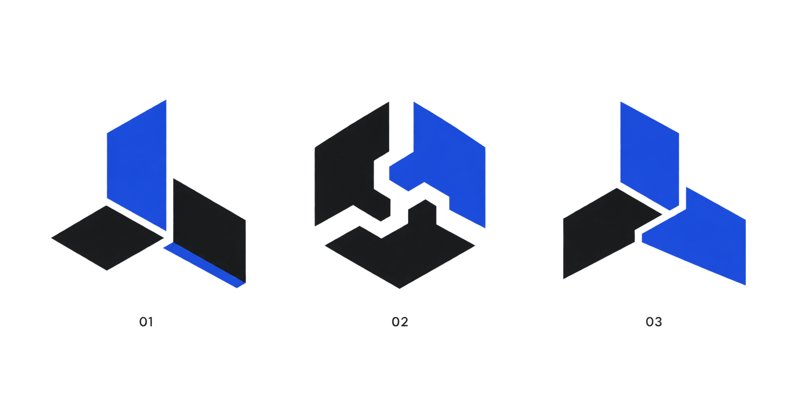

# The Joint — logo exploration

Status: concept review only. The public site continues to use the Renoir text wordmark until one direction is approved and redrawn as production SVG artwork.

## Idea

Three precision-cut planes lock into one stable form. They represent design, build, and run being owned by one accountable studio rather than handed between separate vendors.

## Review criteria

- recognisable without the letter R or the Renoir wordmark;
- readable at 16, 24, 48, and 128 pixels;
- works in one colour before cobalt is added;
- does not resemble an infinity mark, chain link, cube, flower, planet, or generic app icon;
- can be reconstructed as clean SVG geometry after a concept is chosen.

Generated with the built-in image generation tool using a `logo-brand` prompt. The raster sheet is reference material, not a production logo file.
